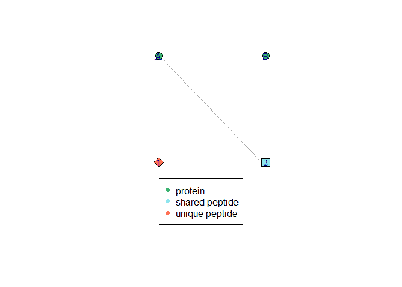

<!-- README.md is generated from README.Rmd. Please edit that file -->

# bppg

<!-- badges: start -->
<!-- badges: end -->

The goal of bppg is to provide functionality to create and characterize
bipartite graphs that show the relationship between peptides and
proteins in bottom-up proteomics.

## Installation

You can install the development version of bppg from
[GitHub](https://github.com/) with:

``` r
# install.packages("devtools")
devtools::install_github("KarinSchork/bppg")
```

## Example

Example on how to plot a bipartite peptide-protein graph

``` r
library(bppg)
biadjacency_matrix <- matrix(c(1,1,1,0), nrow = 2)
G <- igraph::graph_from_incidence_matrix(biadjacency_matrix)
plotBipartiteGraph(G, three_shapes = TRUE, useCanonicalPermutation = TRUE)
```




